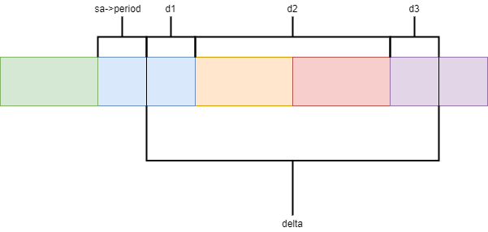

## 什么是负载？

负载（Load）往往与CPU利用率作为系统性能指标成对出现，但二者在定义上却存在着一定的差别。

负载是一个瞬时值，它仅代表当前时刻下进程或者运行队列对系统造成的“压力”；而CPU利用率却是一个累计值，它代表一段时间内，一个CPU或所有CPU的使用状况。

清楚系统当前的负载，可以方便进程迁移（以负载均衡为目的），更好地利用CPU资源，以及进行更有效的电源管理。

在Linux 3.8版之前，负载的跟踪目标是运行队列；Linux 3.8版本之后，引入了PELT（per-entity load tracking）算法，可以将负载的跟踪目标细化到每个调度实体。

## per-entity load tracking

时间（物理时间，不是虚拟时间）被分成了一个个1024us的序列，根据该entity在这段时间内处于runnable状态（正在CPU上运行或者等待CPU调度运行）的时间和过去周期的负载进行计算当前负载。

一个调度实体对系统负载的总贡献为：

$$ L = L_{0} + L_{1} * y + L_{2} * y^{2} + L_{3} * y^{3} + ... + L_{n} * y^{n} $$

$y$为衰减因子，$L_{x}$为向前$x$个周期内的runnable占用1024us的比例。



$$ y^{32} = 0.5 $$

$$ y = 0.97857206 $$

 - `sa->period_contrib`为上次负载计算时，未满1024us的部分。

 - `delta`可以分成三个部分，`d1`是上次更新未满1024us的部分，`d2`为满1024us的部分，记为(p-1)个周期，`d3`为截止计算式未满1024us的部分。

记上次计算时的负载贡献为 $u$ ，当前的负载贡献为 $u^{'}$，则两者关系如下：

$$ u^{'} = (u + d1) * y^{p} + 1024\sum_{n=1}^{p-1}y^{n} + d3 * y^{0} $$

该公式的计算可以分解为以下两部分：

$$ u * y^{p} $$

$$ d1 * y^{p} + 1024\sum_{n=1}^{p-1}y^{n} + d3 * y^{0} $$

其中第二部分的$1024\sum_{n=1}^{p-1}y^{n}$等价为：

$$ 1024\sum_{n=1}^{p-1}y^{n} = 1024 (\sum_{n=0}^{\infty}y^{n} - \sum_{n=p}^{\infty}y^{n} - y^{0}) = 1024(\sum_{n=0}^{\infty}y^{n} - y^{p}\sum_{n=0}^{\infty}y^{n} - y^{0}) $$

因为$y$<1，所以$1024\sum_{n=0}^{\infty}y^{n}$ 收敛，内核将该值提前计算好记录在宏`LOAD_AVG_MAX`。

故$1024\sum_{n=1}^{p-1}y^{n}$可以用下面这个式子进行计算：

$$ LOAD\_AVG\_MAX - decay\_load(LOAD\_AVG\_MAX, p) - 1024 $$

其中，$decay\_load(a, b) = a * y^{b}$。

## decay_load

`Paul Turner`最初提交的版本：

```c
static __always_inline u64 decay_load(u64 val, int n)
{
    for(; n && val; n--) {
        val *= 4008;
        val >>= 12
    }
    return val;
}
```

$$ (4008/(2^{12}))^{32} = 0.499078058 \approx 0.5 $$

故，$0.5 = y \approx (4008/(2^{12}))$。

内核现在的实现：

```c
static u64 decay_load(u64 val, u64 n)
{
    unsigned int local_n;

    if (unlikey(n > LOAD_AVG_PERIOD * 63))
        return 0;
    
    local_n = n;

    if (unlikely(local_n >= LOAD_AVG_PERIOD)) {
        val >>= local_n / LOAD_AVG_PERIOD;
        local_n %= LOAD_AVG_PERIOD;
    }

    val = mul_u64_u32_shr(val, runnable_avg_yN_inv[local_n], 32);
    return val;
}
```

 1. `LOAD_AVG_PERIOD`=32，32*63个周期前的负载对当前忽略不计；
 2. 当n>=32时，要进行一个额外的处理。

额外处理：

$$ y^{n} = (1/2)^{\lfloor n/32\rfloor} * y^{n\%32} $$

```c
val = mul_u64_u32_shr(val, runnable_avg_yN_inv[local_n], 32);
```

用于计算当`local_n`<32时的$val * y^{local\_n}$。

`runnable_avg_yN_inv`数组里存放的$y^{n} * 2^{32}$的值。

这里`mul_u64_u32_shr()`函数也非常有意思。

```c
static inline u64 mul_u64_u32_shr(u64 a, u32 mul, unsigned int shift)
{
    u32 ah, al;
    u64 ret;

    al = a;
    ah = a >> 32;

    ret = ((u64)al * mul) >> shift;
    if (ah)
        ret += ((u64)ah * mul) << (32 - shift);

    return ret;
}
```

`mul_u64_u32_shr()`函数将a分成高32位ah和低32位lh（a是一个64位整型变量，其中高32位代表整数部分，低32位代表小数部分），分别和mul进行相乘再相加。由于shift大于等于0，因此平移操作保证一个32位数和64位数相乘，其结果不超过64位，并且shift用于补偿mul的右移操作。

## 数据结构

`struct sched_avg`结构体记录调度实体se或者就绪队列cfs_rq的负载信息。

```c
struct sched_avg {
    u64                 last_update_time;// 上一次更新的时间
    u64                 load_sum;
    u64                 runnable_sum;
    u32                 util_sum;
    u32                 period_contrib;// 上次更新时，未满1024us的部分
    unsigned long       load_avg;
    unsigned long       runnable_avg;
    unsigned long       util_avg;
    struct util_est     util_est;
} __cacheline_aligned;
```

 - `load_{sum|avg}`：记录runnable状态的负载情况；
 - `runnable_{sum|avg}`：记录load_{sum|avg}的去weight版本；
 - `util_{sum|avg}`：记录running状态下的负载情况。

## accumulate_sum

```c
static __always_inline u32
accumulate_sum(u64 delta, struct sched_avg *sa,
            unsigned long load, unsigned long runnable, int running)
{
    u32 contrib = (u32)delta;
    u64 periods;

    delta += sa->period_contrib; 
    periods = delta / 1024;

    if (periods) {
        // 对之前的周期进行衰减
        sa->load_sum = decay_load(sa->load_sum, periods);
        sa->runable_sum =
            decay_load(sa->runable_sum, periods);
        sa->util_sum = decay_load((u64)(sa->util_sum), periods);

        delta %= 1024;
        if (load) {
            contrib = __accumlate_pelt_segments(periods,
                    1024 - sa->period_contrib, delta);
        }
    }
    // 更新
    sa->period_contrib = delta;

    if (load)
        sa->load_sum += load * contrib;
    if (runnable)
        sa->runnable_sum += runnable * contrib << SCHED_CAPACITY_SHIFT;
    if (running)
        sa->util_sum += contrib << SCHED_CAPACITY_SHIFT;
    
    return periods;
}
```

## __accumulate_pelt_segments

`__accumulate_pelt_segments()`就是在计算 $d1 * y^{p} + 1024\sum_{n=1}^{p-1}y^{n} + d3 * y^{0}$这个部分：

```c
static u32 __accumulate_pelt_segments(u64 periods, u32 d1, u32 d3)
{
    u32 c1, c2, c3 = d3;
    c1 = decay_load((u64)d1, periods);
    c2 = LOAD_AVG_MAX - decay_load(LOAD_AVG_MAX, periods) - 1024;
    return c1 + c2 + c3;
}
```

## 更新负载时机

更新调度实体负载的函数是`update_load_avg()`，该函数会在以下情况调用：

 - enqueue_entity
 - dequeue_entity
 - scheduler tick

```c
static inline void update_load_avg(struct cfs_rq *cfs_rq, struct sched_entity *se, int flags)
{
    u64 now = cfs_rq_clock_task(cfs_rq);
    struct rq *rq = rq_of(cfs_rq);
    int cpu = cpu_of(rq);
    int decayed;

    if (se->avg.last_update_time && !(flags & SKIP_ACE_ALOD))
        __update_load_avg_se(now, cpu, cfs_rq, se);
    
    decayed = update_cfs_rq_load_avg(now, cfs_rq);
}
```

 1. `__update_load_avg_se()`更新调度实体se；
 2. `update_cfs_rq_load_avg()`更新cfs_rq。

## 参考资料：

[CFS调度器：负载跟踪与更新](https://zhuanlan.zhihu.com/p/158185705)

[CFS调度器（4）-PELT(per entity load tracking)](http://www.wowotech.net/process_management/450.html)
